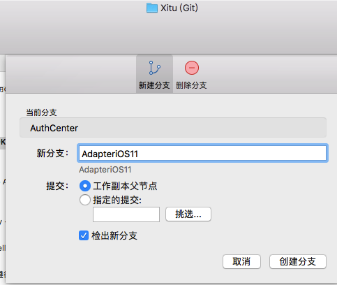
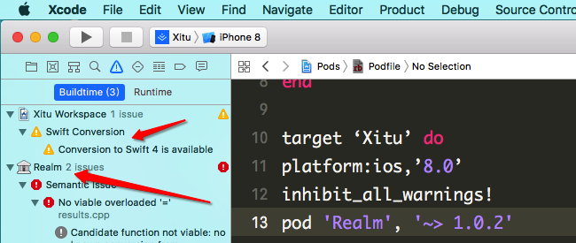
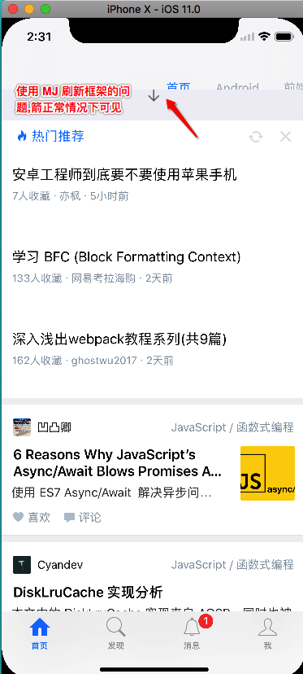
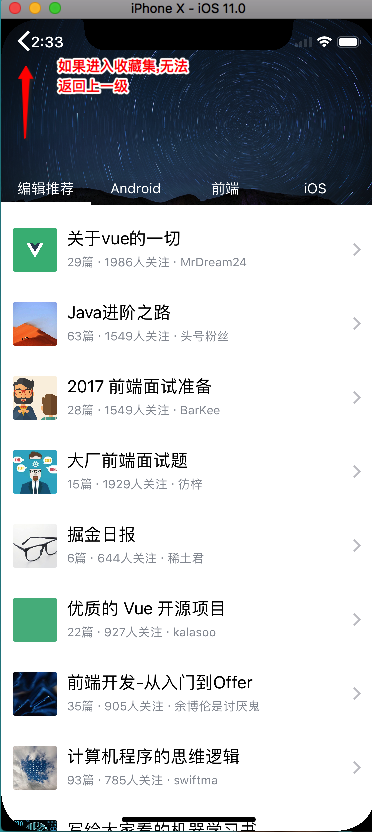
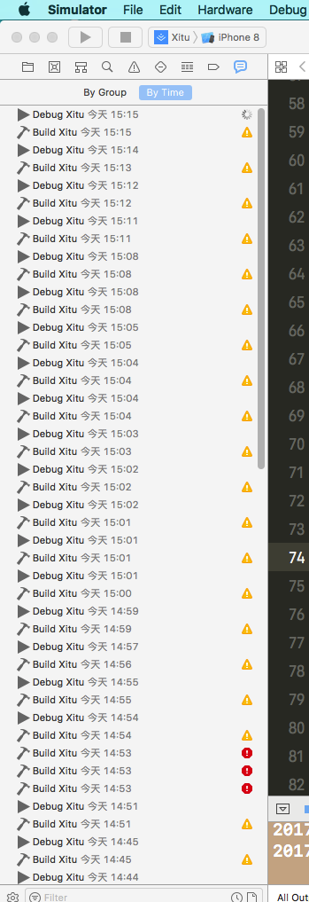
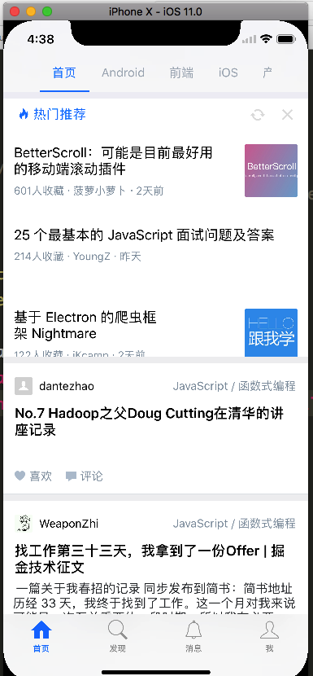
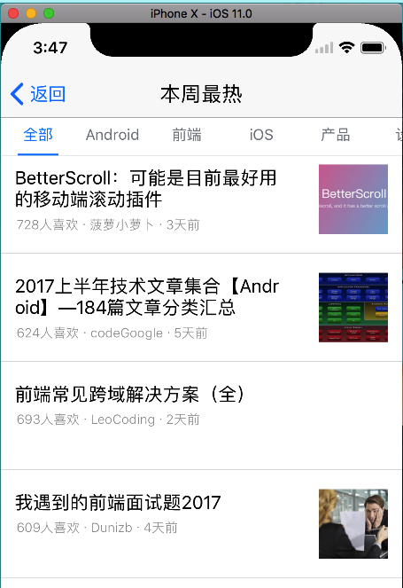
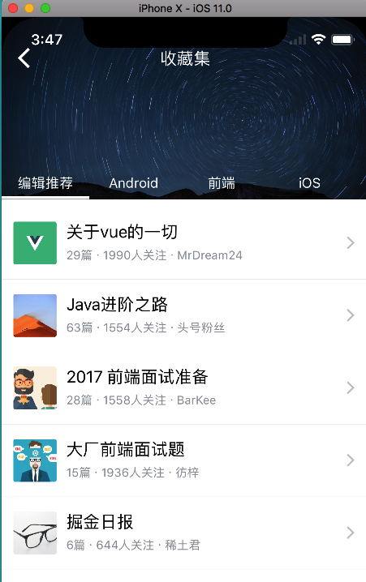

##掘金客户端适配`iOS11`简单记录<一>

#### 前言:不怕苹果出新货,就怕新货齐刘海

- [Xcode 9 GM seed](https://developer.apple.com/download/)
- iPhone X的显示高度相对于iPhone 4.7 `top`44  `bottom` 34
- [三分钟搞懂iPhone X设计尺寸和适配](http://www.jianshu.com/p/cf093e457698)

### 新建分支后Xcode9运行项目

- 因为兼容 Swift3.0,所以不会像之前Swift2升级Swift3一堆报错,只是一个提醒你升级到 Swift4.0,后期有时间还是要改涉及的部分.

	- 

- Realm 版本1.0过旧报错

	- 


- 解决Realm 版本1.0过旧报错问题
	
	- pod 'Realm', '~> 3.0.0-beta.3' ,Installing Realm 3.0.0-beta.3 (was 1.0.2) 
	- 版本差异导致的API报错修复,下下图 
	- 

```
1.0.0
	RLMResults<HomeCacheModel *> *resultsCacheModelArr = [cacheModelArr sortedResultsUsingProperty:@"createdAtStringDate" ascending:NO];

	[realm addOrUpdateObjectsFromArray:array];
    
3.0.0

	[realm addOrUpdateObjects:array];

 	RLMResults<HomeCacheModel *> *resultsCacheModelArr = [cacheModelArr sortedResultsUsingKeyPath:@"createdAtStringDate" ascending:NO];

再跑一把,还不是美滋滋的运行起来了.
	
```

### 选择 iPhone X 看看效果未适配效果

- 初步运行界面发现的问题如下
	- 消息/首页/首页分类列表界面首次可以看到箭头
	- 首页选项卡(只显示一半,无法点击!) 
	- 进入收藏集无法返回(只能杀死再进 app)
	- 本周最热/专栏界面,选项卡只可以看到最下面,邮箱正常使用
	- 截图如下 ....

- 
- 
- 
- 
- 


### 适配界面阶段

- 关于`UIScrollView`以及子类目前网上推荐的二种处理方式一下`contentInsetAdjustmentBehavior`属性

- 以上问题目前均已解决,虽然解决了一部分问题,但是代码还是要写的,只有继续写代码才能维持现在的生活.

- 具体代码参考以下.

```
1. 可以在 Xcode8运行起来.
 do {
        _Pragma("clang diagnostic push")
        _Pragma("clang diagnostic ignored \"-Warc-performSelector-leaks\"")
        if ([UIScrollView instancesRespondToSelector:NSSelectorFromString(@"setContentInsetAdjustmentBehavior:")]) {
            [self  performSelector:NSSelectorFromString(@"setContentInsetAdjustmentBehavior:") withObject:@(2)];
            isadjust = YES;
        }
        _Pragma("clang diagnostic pop")
    } while (0);
	
	
2.  使用available关键字判定
	if (@available(iOS 11.0, *)) {
	_tableView.contentInsetAdjustmentBehavior = UIScrollViewContentInsetAdjustmentNever;
	}


3.掘金涉及到tableview example code

   	UIEdgeInsets edges = UIEdgeInsetsMake(64, 0, TABBAR_HEIGHT_XITU, 0);
   self.tableview.contentInset = edges;
   self.tableview.scrollIndicatorInsets = edges;
   
4. 暂时适配如下(后期会优化)
// 根据版本获取高度 ,之前均为64,14是瞎写的
- (CGFloat)adapteriOS11{
    if ([[UIDevice currentDevice].systemVersion floatValue] >=11.0) {
        return 14;
            do {
                _Pragma("clang diagnostic push")
                _Pragma("clang diagnostic ignored \"-Warc-performSelector-leaks\"")
                if ([UIScrollView instancesRespondToSelector:NSSelectorFromString(@"setContentInsetAdjustmentBehavior:")]) {
                    [self  performSelector:NSSelectorFromString(@"setContentInsetAdjustmentBehavior:") withObject:@(2)];
                }
                _Pragma("clang diagnostic pop")
            } while (0);
    }else{
        return NAVIGATION_TOP_XITU;
    }
}
5.  IPHONE_X 齐刘海需要单独更改下,不然有的界面到 nav 间距有问题

if (kScreenHeight == IPHONE_X_HEIGHT) begainYValue = begainYValue + TWENTY_XITU;

6.有选项卡界面,iPhone 8/x需要区别对待.启东图等在 x 在有变形,后期再说

7.跑一把发现5s-8p 系列, IPHONE_X均可以最正常显示了

```

### DEBUG阶段

- Xcode9开始支持模拟器多开,同时运行着 iPhone 8/x 无压力,还不是美滋滋的调试.




### 适配部分界面后效果

- 这只是很小一部分工作,因为我是接盘的,今天适配完是不可能的,明天周六也是不可能的了,只能下周来了继续了.






